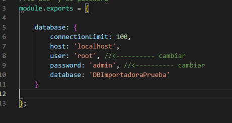

# pruebaProgramacion
***
Se realizo una aplicacin web con las tecnologías de nodejs,mysql y handlebars como framework de plantillas
## Ambiente local de desarrollo
Para empezar con el proyecto se debe de instalar primero las tecnologías de:
*nodejs
*mysql
*un editor de codigo (vscode)
### Nodejs
Primero se debe de descargar e instalar [nodejs] (https://nodejs.org)
*Puedes escoger la version 16.17.0 LTS y luego de descargarla procede a instalarlo.
*Al terminar, presiona la tecla Windos+R y luego escribes "cmd" (Esto es para usuarios Windows), te saldra una ventana que es la consola, alli escribes
```bash
node -v
```
Esto para verificar tu version de nodejs que se instalo en tu computadora.
### MySQL
Ahora puedes descargar el instalador de [MySQL](https://dev.mysql.com/downloads/mysql/)
*Selecciona para el sistema operativo que desees y descarga la version "(mysql-8.0.30-winx64.zip)"
Luego procede a instalarlo y recuerda que se debe de agregar un usuario y constraseña durante la instalacion
*Ahora bien para verificar nuestra version y que este instalado nuestra base de datos buscamos en nuestra ventana de windows la herramienta de MySQL shell, seleccionala y escribe "mysql" te aparecera la version, para linux puedes abrir la consola y escribir
```bash
mysql -V
```
### Visual Studio Code
Bien ahora debemos de instalar un IDE para escribir nuestro codigo y este es [Visual Studio Code](http://https://code.visualstudio.com)
*Lo descargamos y luego lo instalamos, para verificar si esta instalado, podemos hacer algo sencillo, con la tecla "windows", escribir la palabra "Visual Studio"

## Levantar la aplicación
Antes de correr nuestra aplicación se debe de clonar el repositorio o descargar el archivo .zip que proporciona Github

## Base de datos
Para correr nuestra base de datos se debe de ejecutar en "MySQL Workbench" ingresamos nuestra coneccion local y nos pedira la contraseña, luego de ingresar podemos abrir el documento sql que esta unido a este proyecto "ImportadorPrueba.sql" y luego de abrirlo lo ejecutamos, tendria que crear la base de datos con las tablas sin ningun problema.

### MySQL Conexion
Al haber creado nuestra Base de datos debemos de dirigirnos a nuestro proyecto en el apartado de "keys.js", ahi debemos de cambiar el apartado de "user" y "password"; por el nombre de usuario y la contraseña que escogimos al momento de instalar nuestro MySQL(es decir nuestra conexion local) 


### NPM INSTALL
Al tener nuestra documento con el proyecto lo abrimos en nuestro editor de codigo en este caso (visual studio code), abrimos una terminal, dandole click izquierdo en la parte de arriba superior izquierda donde dice terminal>New terminal, se desplegara una terminal y escribimos lo siguiente:
```bash
npm install
```
Luego esperamos a que se installen todas las dependencias que tiene el proyecto.

### NPM RUN
Al finalizar la instalacion de las dependencias se puede correr el proyecto con el siguiente comando
```bash
npm run dev
```
el "dev" es para indicarle que busque en la parte de los scripts la variable "dev": y que inicie la aplicación, en este caso inicia en la carpeta src y el archivo index.js (src/index.js)


### Ejecución
Si todo corre bien nos indicara que el proyecto esta corriendo en el puerto 4000 y esta conectado a la base de datos, lo que podemos hacer es abrir nuestro navegador y insertar en el apartado de las urls:
```bash
http://localhost:4000
```


### Login
Para ingresar como usuario se debe de crear un usuario con el rol de "usuario" y "admin" como administrador de los usuarios


## Errores
### MySQL
Si en algun dado caso de la base de datos ocurre un problema de autentificación y los provilegios del usuario de la base de datos puede ejecutar este comando en la base de datos
```bash
ALTER USER 'root'@'localhost' identified with mysql_native_password by 'password'
```
Asegúrese de cambiar password (contraseña) a una contraseña segura de su elección, es decir que se puede poner la misma que la de su conexion de la base de datos


### Tabla .sessions
Si llega a presentar este error lo que debe hacer es parar la ejecucion del proyecto en "vscode" y volver a ejecutarlo


### Codigo
Falto el desarrollo de capturar el "id" del "estado" que seleccionaba el usuario para ingresar un nuevo Carro y de igual modificarlo, asi que tira error al poder ingresar y editar a un carro, ya que es obligatorio tener el "id" del "estado" del Carro

### Usuarios existentes
Los usuarios existentes en la base de datos no pueden loguearse porque estos no poseen un password cifrado entonces el programa no lo detecta que venga cifrado por lo tanto no los deja ingresar, por eso se deben de ingresar nuevos ya corriendo la página 
